# Building a 10BASE-T1S ↔ 100BASE-T Bridge from a Standard LAN865x Project

**A technical brief on turning a single-interface MPLAB Harmony LAN865x application into a
transparent Layer-2 bridge using MCC, on the ATSAME54P20A.**

---

## 1. Purpose and scope

This note describes the MCC (MPLAB Code Configurator) procedure for extending a standard,
single-interface LAN865x TCP/IP application (one 10BASE-T1S network interface, no bridging)
into a two-port device that bridges 10BASE-T1S traffic to a 100BASE-T segment and back,
transparently, at Layer 2.

The target hardware is a SAM E54 (ATSAME54P20A) with:

- an on-board **LAN865x** 10BASE-T1S MAC-PHY, connected over SPI, and
- the SAM E54's internal **GMAC**, driving an external **LAN8742A** 100BASE-T PHY over RMII.

The end result is a device with two physical Ethernet ports that behaves as one switch port
from the perspective of any host on either side — a host on the T1S bus and a host on the
100BASE-T segment can ping each other directly, without addressing the bridge device itself.

This document describes *how* to build the configuration. The reasoning behind each
non-obvious step — including two subtle pitfalls that silently prevent the bridge from
forwarding traffic even though the stack initializes without error — comes from a real
bring-up session; the full diagnostic narrative (with CLI command output, register-level
evidence, and dead ends) is kept separately in `session-log.md` in this same folder.

## 2. Starting point

The starting point is a standard MCC-generated application with a single MAC-layer instance
(LAN865x, MAC Layer component) wired to a single `NETCONFIG` network configuration instance —
no GMAC component, no second PHY, no MAC Bridge component.

## 3. Target architecture

The finished Data Link Layer graph has **two** MAC-layer instances feeding **two** `NETCONFIG`
instances, both marked as bridge members:

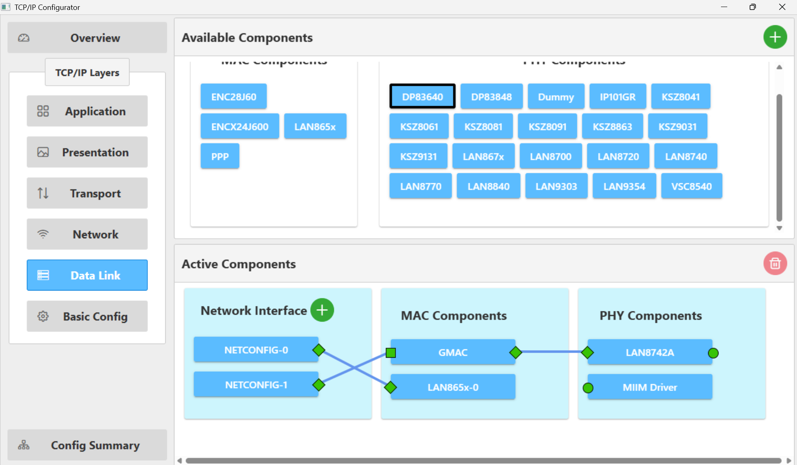

- **`LAN865x` → `Instance 0`** (SPI-attached MAC-PHY) → `NETCONFIG-0` — the 10BASE-T1S side.
- **`GMAC` → `LAN8742A` PHY** (RMII, MDIO) → `NETCONFIG-1` — the 100BASE-T side.

## 4. Step-by-step MCC procedure

### 4.1 Add the second MAC/PHY pair

In the **Data Link Layer** view of the Project Graph, add a `GMAC` MAC-layer component and
wire an external PHY component (`LAN8742A` in this case — pick whatever part is actually
populated on your board) to its `PHY` connector. Add a second `NETCONFIG` instance and wire
it to the new MAC's `MAC` connector.

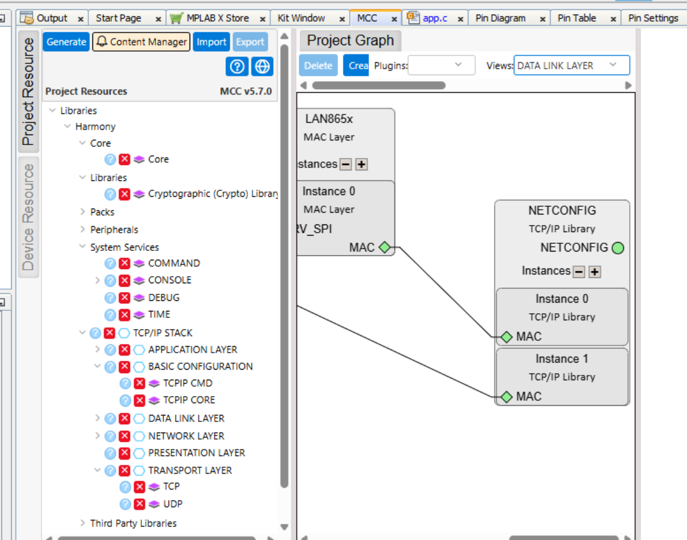

### 4.2 Assign the GMAC pins

Wiring the GMAC/PHY components into the graph does **not** automatically assign pins. Open
the separate MCC **Pins** editor (not the TCP/IP Configurator popup) and assign the ten
RMII + MDIO signals to the GMAC function:

`PA12` (`GMAC_GRX1`), `PA13` (`GMAC_GRX0`), `PA14` (`GMAC_GTXCK`), `PA15` (`GMAC_GRXER`),
`PA17` (`GMAC_GTXEN`), `PA18` (`GMAC_GTX0`), `PA19` (`GMAC_GTX1`), `PC20` (`GMAC_GRXDV`),
`PC22` (`GMAC_GMDC`), `PC23` (`GMAC_GMDIO`).

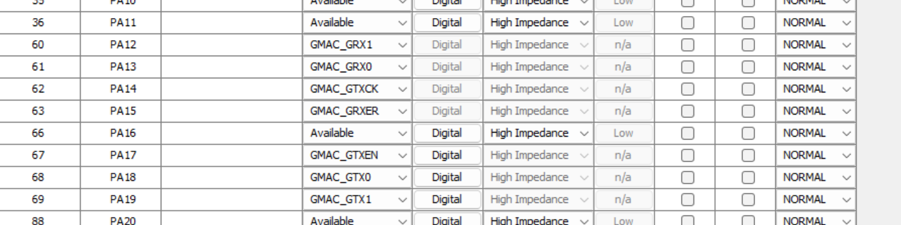

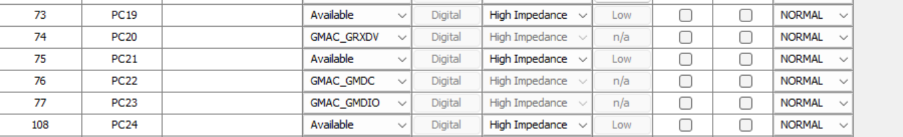

Without this step the MDIO lines never reach the physical PHY and GMAC initialization fails
outright, independent of everything else in this document.

### 4.3 Configure each network interface (IP, MAC address)

Select each `NETCONFIG` instance and fill in its Basic Configuration: interface name, host
name, MAC address, static IP/mask/gateway (or DHCP, if that fits your setup).

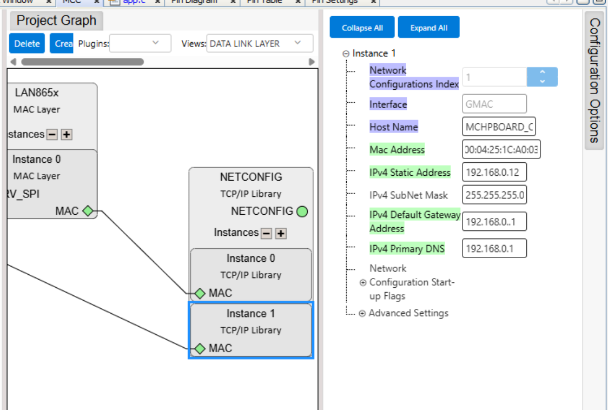

Two things worth double-checking here, both easy to get wrong by mistyping an address by
hand and both **silently swallowed by MCC without a validation error**:

- Give each interface a genuinely valid, well-formed IP address and gateway (`192.168.0.12`,
  not `192.168..12` — a missing octet parses to nothing and the interface falls back to
  `0.0.0.0` at boot, with no error printed anywhere).
- Give each interface its **own, distinct MAC address**. If you leave one interface's MAC
  address field at its auto-generated default without ever setting the other one's field
  yourself, both can end up computed to the same value.

### 4.4 Enable promiscuous mode on **both** MAC ports

This is the step that is easy to miss because the stack, and even the bridge module itself,
initializes and reports "ready" without it — the bridge just silently never forwards
anything, on one or both ports.

A bridge port must see **every** frame that arrives on its segment, not just frames
addressed to the device's own MAC address, in order to learn source addresses and make
forwarding decisions for traffic that isn't addressed to itself. By default, both MAC
drivers here filter out anything not addressed to their own MAC before the bridge ever gets
a chance to see it — each side needs its own equivalent of "promiscuous mode" turned on
explicitly.

**LAN865x side** — component `LAN865x` → `Instance 0` → **Advanced Settings** →
**"Promiscuous"** checkbox:

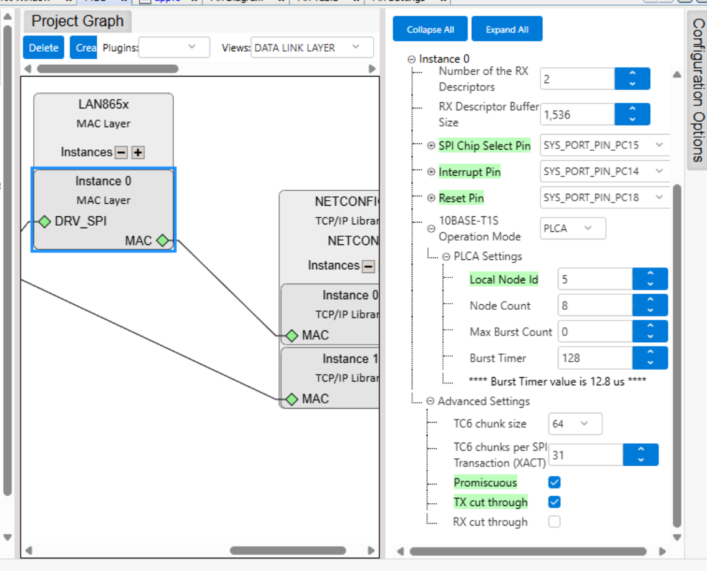

**GMAC side** — component `GMAC` → **Ethernet RX Filters Selection** →
**"Accept All Packets (Promiscuous Mode)"** checkbox:

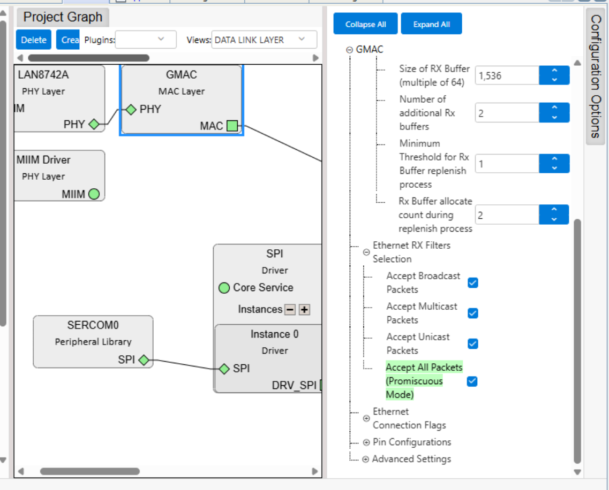

Both must be checked. Enabling only one produces a bridge that forwards correctly in one
direction and silently drops everything in the other — which looks confusingly like "mostly
working" rather than "not working at all," and is significantly harder to spot without
per-port packet counters (see §5).

### 4.5 Enable MAC bridging on both interfaces

There is no separate, standalone "MAC Bridge" component to add in MCC. Bridging is switched
on per network interface: on **each** `NETCONFIG` instance's Basic Configuration, tick
**"Add to MAC Bridge."** Once two or more interfaces have this checked, MCC automatically
generates the entire bridge module — forwarding database, packet pools, and the bridge's own
"Advanced Settings" panel (which, for lack of its own top-level component, appears nested
under one of the `NETCONFIG` entries in the Project Graph tree).

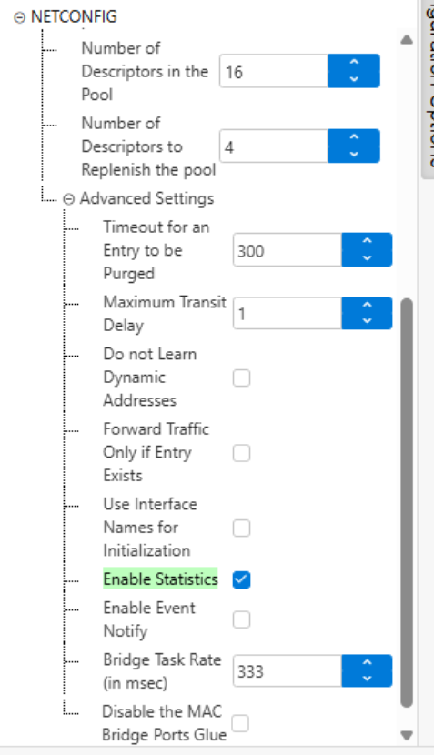

Recommended: also tick **"Enable Statistics"** and **"Enable Event Notify"** here. Neither
is required for the bridge to function, but both are what make the bridge's state
observable from the command line afterward (§5) — without them `bridge stats` returns
nothing meaningful.

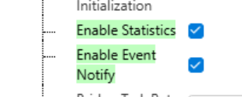

### 4.6 Size the heaps generously

The TCP/IP stack's internal heap, and the C-runtime (libc) heap backing it, both need to be
large enough for **two** active network interfaces plus a bridge (packet pools, descriptor
pools, forwarding database) — not just one. This project's `TCPIP_STACK_HEAP_TYPE_INTERNAL`
configuration obtains its entire TCP/IP heap via a single `malloc()` call out of the
C-runtime heap, so both numbers matter together, not independently.

Undersizing either one produces a symptom that has nothing obviously to do with memory: the
GMAC driver's own descriptor/buffer allocation call fails partway through initialization,
and the stack reports it as a generic
`TCP/IP Stack: GMAC MAC initialization failed` / `Initialization failed 9 - Aborting!` at
boot — indistinguishable, from the log alone, from a pin, clock, or PHY-address problem.

**TCP/IP stack heap** — component `TCPIP CORE` → **Heap Configuration** →
**"TCP/IP Stack Dynamic RAM Size."** As a starting point, size for roughly 1.5–2× what a
single-interface project would need; this project ended up at `65535` bytes for two
interfaces plus bridging.

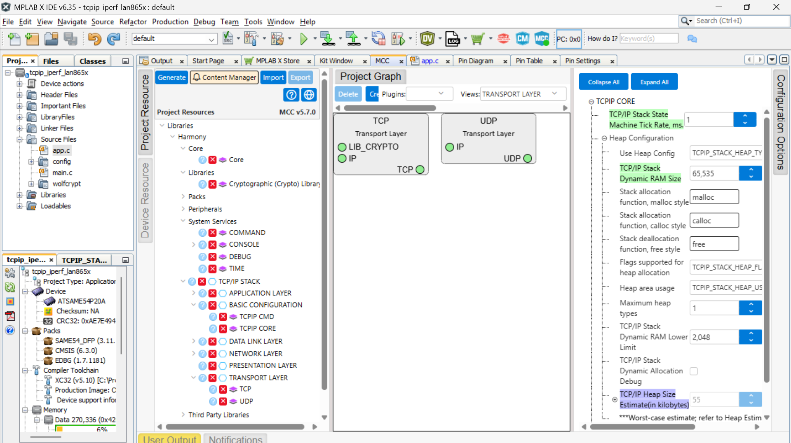

**Linker (libc) heap** — `System` → `Project Configuration` → `XC32 Global Options` →
`Linker` → `General` → **"Heap Size (bytes)."** Must comfortably exceed the TCP/IP stack
heap size above, to leave headroom for every other `malloc()`/`calloc()` call in the
firmware (LAN865x driver, console, etc.).

| Before | After |
|---|---|
| 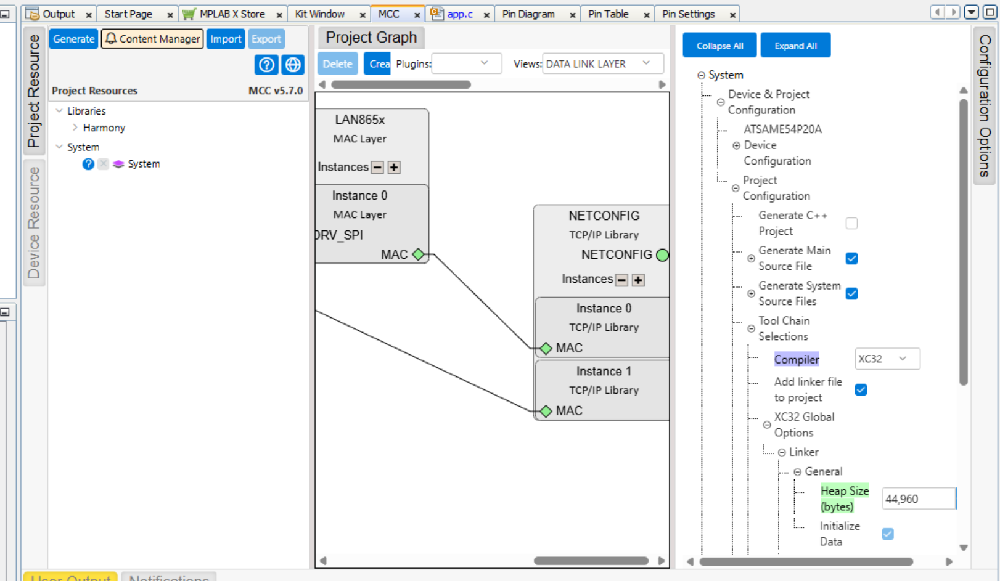 | 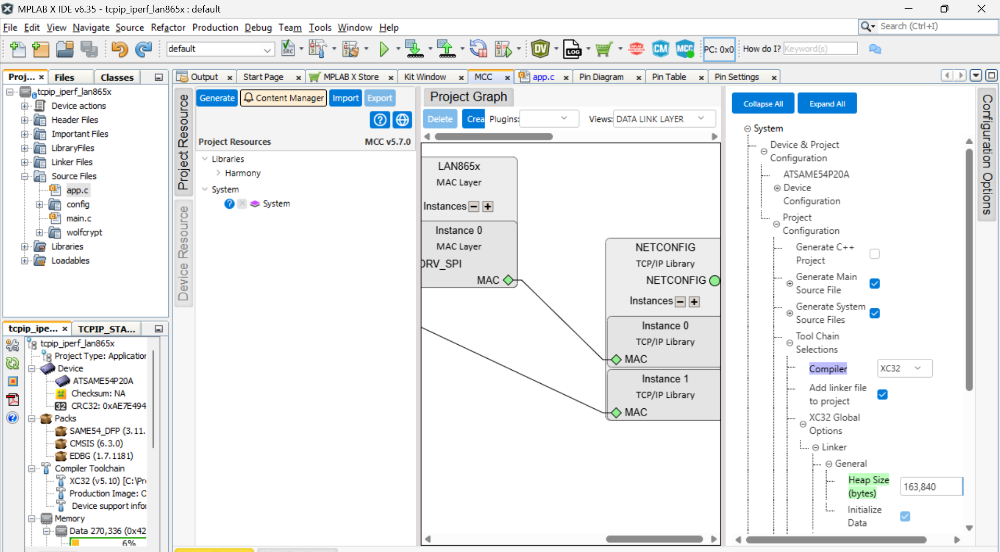 |

### 4.7 Generate Code, build, flash

Run **Generate Code** from the MCC main-window toolbar (not the TCP/IP Configurator popup —
only the toolbar action reliably regenerates `configuration.h`/`initialization.c`; the
Configurator's own "Configuration Summary" view reflects the in-memory model, not what has
actually been written to the generated sources). Then build and flash as usual.

## 5. Verifying the bridge

A green "Link is UP" on both interfaces is not sufficient evidence that bridging works —
each interface can be perfectly healthy as its own IP host while the bridge itself forwards
nothing between them. Use the serial console.

**Confirm both interfaces are up and correctly addressed:**

```
netinfo
```

should show `Link is UP`, `Status: Ready`, and a valid, non-`0.0.0.0` IP on both interfaces.

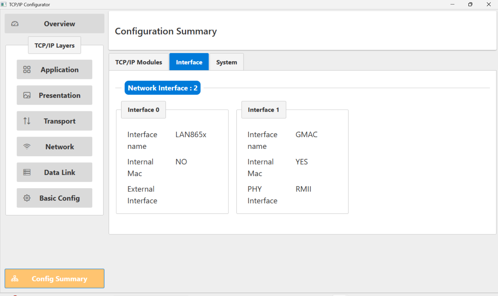

**Inspect the bridge module directly**, using the built-in `bridge` console command
(available once `TCPIP_STACK_MAC_BRIDGE_COMMANDS` is enabled, which it is by default once
bridging is turned on):

```
bridge status              # module status - should read "ready"
bridge fdb show            # forwarding database: which MACs were learned on which port
bridge stats                # per-port packet counters (needs "Enable Statistics", see 4.5)
```

`bridge fdb show` is the most useful single diagnostic during bring-up: after generating
some traffic on each side (a ping is enough), you should see a dynamic entry learned **on
each port** for the peer devices on that segment. If entries only ever appear for one port,
that port's promiscuous-equivalent setting (§4.4) is the first thing to re-check —
`bridge stats`' `pkts received` and `fwd ucast` counters for that port staying at zero
despite generated traffic is the confirming signature of exactly that problem.

**The actual proof of a working bridge** is two hosts, one on each physical segment, pinging
each other directly — neither one addressing the bridge device's own IP addresses at all:

```
# from a host on the 100BASE-T side:
ping <IP of a device on the T1S bus>

# from a device on the T1S bus:
ping <IP of the host on the 100BASE-T side>
```

Both directions succeeding, with the bridge's own `bridge stats` showing non-zero, roughly
symmetric `fwd ucast` counts on both ports, is the end-to-end confirmation that the
configuration in this document produces a genuinely transparent Layer-2 bridge.

## 6. Summary checklist

- [ ] Second MAC/PHY (GMAC + external PHY) added to the Data Link Layer graph, wired to a
      second `NETCONFIG` instance
- [ ] All ten GMAC RMII + MDIO pins assigned in the **Pins** editor
- [ ] Each `NETCONFIG` instance has a valid, distinct IP address, gateway, and MAC address
      (re-check for typos — MCC does not validate these strings)
- [ ] Promiscuous mode enabled on **both** ports — LAN865x's "Promiscuous" checkbox **and**
      GMAC's "Accept All Packets (Promiscuous Mode)" checkbox
- [ ] "Add to MAC Bridge" checked on **both** `NETCONFIG` instances
- [ ] "Enable Statistics" (and optionally "Enable Event Notify") checked, for CLI
      observability
- [ ] TCP/IP stack heap **and** linker heap sized generously for two interfaces plus bridging
- [ ] Generate Code run from the main-window toolbar, then build and flash
- [ ] Verified with `netinfo`, `bridge status`/`stats`/`fdb show`, and — the real test — a
      ping between a host on each physical segment that never addresses the bridge itself

## See also

- `session-log.md` (this folder) — the full chronological bring-up narrative this brief was
  distilled from, including exact CLI commands used, raw `bridge stats`/`fdb show` output at
  each stage, and dead ends investigated and ruled out along the way.
- `CLAUDE.md` (project root) — working rules for this project, including the hard rule that
  MCC-generated files are never hand-edited, and further known MCC-regeneration pitfalls.
