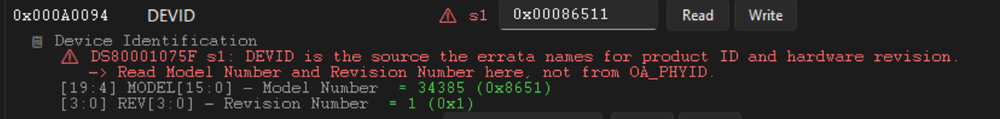
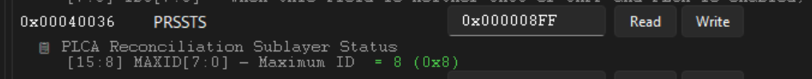
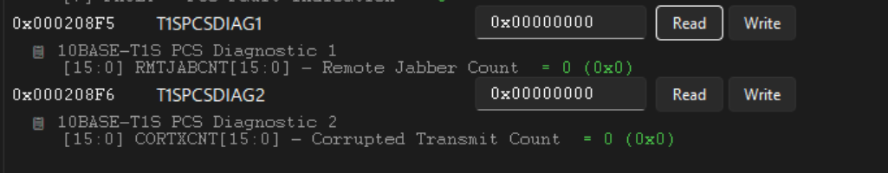
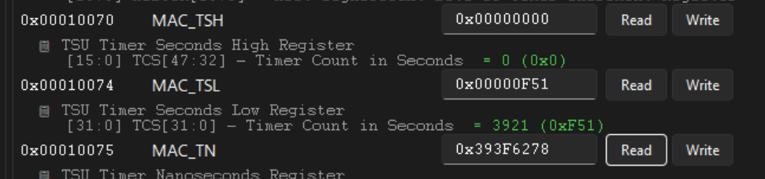
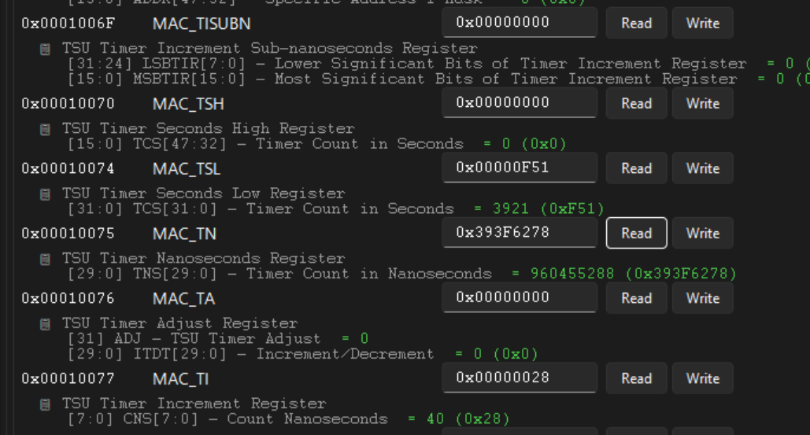

# Register Tool Live Demo — Worked Examples

Cheat sheet for a live demo of the "LAN8651 Registers" tab in `bridge_gui.py`.
All addresses/values below are verified against this project's own
hardware-checked register model (`json/lan8651_model.json`) — not guessed.

## How the Register tab is organized (read this first)

- It's a `ttk.Notebook` of sub-tabs, one per MMS (Memory Map Selector) group:
  `MMS0 OA Standard`, `MMS1 MAC`, `MMS2 PHY PCS`, `MMS3 PHY PMA/PMD`,
  `MMS4 PHY Vendor`, `MMS10 Misc`.
- **There is no search/filter box.** Each sub-tab lists its registers as
  plain rows, sorted by ascending address — finding one means picking the
  right sub-tab and scrolling.
- Each row: address label → name → (optional red `⚠` errata warning) →
  an **editable hex value field** → **Read** button → **Write** button. If
  the register has bit fields, a decoded sub-row appears directly below
  once a value is read.
- The top toolbar also has **"🔄 Bulk Register Read All"** and
  **"💾 Bulk Register Write All"** buttons — despite the "current tab"
  wording, these act on **all ~183 registers across every sub-tab**, not
  just the visible one.
- Reading: press **Read** on a row — the value appears in that row's own
  field, decoded bit-fields update automatically underneath.
- Writing: type a value into the field, press **Write** — the tool writes,
  waits briefly, then automatically re-reads the same address and shows the
  confirmed value. Every write is self-verifying.

**Presenter tip:** since there's no search, open the relevant sub-tabs and
scroll to position once *before* going live, rather than searching on stage.

### What's in each sub-tab

Verified against the actual contents of `json/lan8651_model.json` (register
counts and sample mnemonics per group), not guessed from generic PHY
knowledge:

| Sub-tab | Registers | What it groups |
|---|---|---|
| **MMS0 OA Standard** | 22 | The generic OPEN Alliance TC6 SPI-protocol registers (`OA_ID`, `OA_PHYID`, `OA_CONFIG0`, `OA_STATUS0/1`, `OA_BUFSTS`, `OA_IMASK0/1`) plus the legacy Clause-22 basic PHY control/status (`BASIC_CONTROL`, `BASIC_STATUS`, `PHY_ID1/2`) and MMD access registers. Generic across any OA-compliant MAC-PHY — nothing LAN8651-specific here. |
| **MMS1 MAC** | 38 | The Ethernet MAC layer: network control/config (`MAC_NCR`/`NCFGR`), specific-address hash/filter registers (`MAC_HRB/HRT`, `MAC_SAB/SAT1-4`, `MAC_TIDM1-4`), the IEEE 1588-style Time Stamp Unit (`MAC_TSH/TSL/TN/TA/TI` — example #4), and MAC-level frame/byte/error statistics (`STATS0`–`STATS12`). |
| **MMS2 PHY PCS** | 4 | Small, focused group: 10BASE-T1S Physical Coding Sublayer control/status (`T1SPCSCTL`/`STS`) plus the two PCS diagnostic counters, `T1SPCSDIAG1` (Remote Jabber Count) and `T1SPCSDIAG2` (Corrupted Transmit Count) — see the bonus example below. |
| **MMS3 PHY PMA/PMD** | 5 | The analog/electrical layer: PMA/PMD extended ability and control, the transmitter control register `T1SPMACTL` (TXD/loopback bits), transmitter status `T1SPMASTS`, and the IEEE 802.3 §147.5.2 test-mode register `T1STSTCTL`. |
| **MMS4 PHY Vendor** | 62 | The largest group, vendor-specific extensions — dominated by **PLCA**: `PLCA_CTRL1`/`STS1-3` (control/status, incl. `PRSSTS.MAXID` — example #3), transmit-opportunity/beacon counters (`TOCNTH/L`, `BCNCNTH/L`), node-ID matching (`MULTID0-3`) — plus a watchdog (`IWDTOH/L`) and TX-pattern-matching diagnostic registers. |
| **MMS10 Misc** | 52 | Chip-level odds and ends: queue/pad/clock config, the chip ID register `DEVID` (example #1), and a large block of external time-sync peripherals — event-capture channels (`EC0`–`EC3CTRL`), pulse-generator channels (`EG0`–`EG3...`), and one-pulse-per-second output control (`PPSCTL`). Mostly unrelated to normal bridging; relevant for PTP/time-sync use cases. |

---

## 1. Chip identification — `DEVID`

| | |
|---|---|
| Sub-tab | **MMS10 Misc** |
| Address | `0x000A0094` |
| Expected value (this board) | `0x00086511` |

Click the row, press **Read**. Decoded: `MODEL = 0x8651` (LAN8651),
`REV = 0x1`.

**Why this one and not `OA_PHYID` (`0x00000001`, MMS0):** the datasheet
errata explicitly warns that `OA_PHYID` does **not** reliably identify the
LAN8650/1 or its silicon revision — only `DEVID` does. Good talking point:
"the obvious-looking ID register is actually the wrong one to trust."

---

## 2. Write a value and see it change — `PLCA_CTRL1`

| | |
|---|---|
| Sub-tab | **MMS4 PHY Vendor** (scroll past `PRSSTS`, see #3 below) |
| Address | `0x0004CA02` |
| Bit layout | `NODE_CNT` bits 15:8, `NODE_ID` bits 7:0 |

**Important GUI limitation to know before presenting:** the value field is
a single raw 32-bit hex box — there are **no separate editable fields**
for `NODE_CNT`/`NODE_ID`. The bit-field rows shown after a read are
read-only decoded labels, not inputs. You compute the combined hex value
by hand.

Demo sequence:
1. **Read** → e.g. `0x00000805` (node count 8, node id 5).
2. Type `0x00000803` into the value field (node id changed to 3, count
   unchanged) and press **Write**.
3. The tool re-reads automatically — field now shows `0x00000803`.

Safe for a live audience: no link drop, no side effects, single command.

**Alternative if you'd rather demo "silencing" something:** `T1SPMACTL`
(`0x000308F9`, same MMS4 sub-tab) — set bit 14 (`TXD`, mask `0x4000`) to
stop the transmitter, read back to confirm. Avoid the `LBE` loopback bit
(bit 0) — not functionally verified on this hardware yet
(`docs/LAN8651_TEST_MODES.md`). Also avoid `T1STSTCTL` (`0x000308FB`) test
modes 1–4 for a *live* audience — they take the T1S link down while active.

---

## 3. Status: how many nodes are on the bus (max count) — `PRSSTS`

| | |
|---|---|
| Sub-tab | **MMS4 PHY Vendor** (above `PLCA_CTRL1` in the address-sorted list) |
| Address | `0x00040036` |
| Field to point at | `MAXID[7:0]`, bits 15:8 — datasheet field name is literally **"Maximum ID"** |

This is *the* register for "what's the max count on the bus" — no other
register in the model has a `MAX`-named counter field
(grep-confirmed against the full 183-register `json/lan8651_model.json`).

**Read** and look at the decoded `MAXID` line. Good explanation point:
`MAXID` is the **coordinator's actually-observed** cycle length — it is
*not* the same thing as this node's own configured `PLCA_CTRL1.NODE_CNT`
(that field only matters when this node itself is the coordinator, ID 0).
On the bench these two values have been observed to differ (e.g. `MAXID`
reads 12 while the local `NODE_CNT` stays at 8) — a nice "configured vs.
observed" contrast to show live.

---

## Bonus: PCS diagnostic counters — `T1SPCSDIAG1` / `T1SPCSDIAG2`

Not one of the four core examples, but a natural follow-on from #3 (same
MMS2 sub-tab area, both are small read-clear counters — good for a "here's
what a healthy bus looks like" moment):

| | |
|---|---|
| Sub-tab | **MMS2 PHY PCS** |
| `T1SPCSDIAG1` | `0x000208F5` — `RMTJABCNT[15:0]`, Remote Jabber Count |
| `T1SPCSDIAG2` | `0x000208F6` — `CORTXCNT[15:0]`, Corrupted Transmit Count |

Both are **read-clear (RC)** — reading resets the counter to 0.
`RMTJABCNT` counts jabber conditions (a node transmitting far too long)
detected from the *far end* of the link. `CORTXCNT` counts how often this
node's *own* transmission got corrupted at the MDI, typically from a real
physical collision — the datasheet explicitly recommends this counter over
the MAC-level `STATS10.XCOL`, since `XCOL` can be confused by PLCA's own
internal *logical* collisions (part of normal arbitration, not a fault).
This is the same register `lan865x_diag.c`'s `plca_stat` command already
reads internally.

---

## 4. "Seconds" register — `MAC_TSH` / `MAC_TSL` (Time Stamp Unit)

No register is literally named "TMU" — the closest real match is the
**TSU (Time Stamp Unit)**, which genuinely counts in seconds:

| | |
|---|---|
| Sub-tab | **MMS1 MAC** |
| `MAC_TSH` | `0x00010070` — upper seconds bits |
| `MAC_TSL` | `0x00010074` — lower seconds bits |

A 48-bit wall-clock seconds counter (IEEE 1588-style timestamp unit).
**Read** both and note they're plain generic rows — this project's CLI has
no dedicated command for them (unlike `plca_stat` for #3), so the GUI's
generic register-row Read/Write is the *only* way to reach them, which
doubles as a demo of the tool's generality: "even without a dedicated
command, any register is one click away."

The full TSU register block also includes `MAC_TISUBN`, `MAC_TN`
(nanoseconds), `MAC_TA` (adjust), and `MAC_TI` (increment) directly above
and below `MAC_TSH`/`MAC_TSL` in the same MMS1 sub-tab, if you want to show
the whole timestamp unit rather than just the two seconds registers:

---

*Source of all addresses/values: `json/lan8651_model.json` (183 registers,
checked against datasheet DS60001734F and errata DS80001075F). GUI
mechanics verified against `scripts/bridge_gui.py`.*
